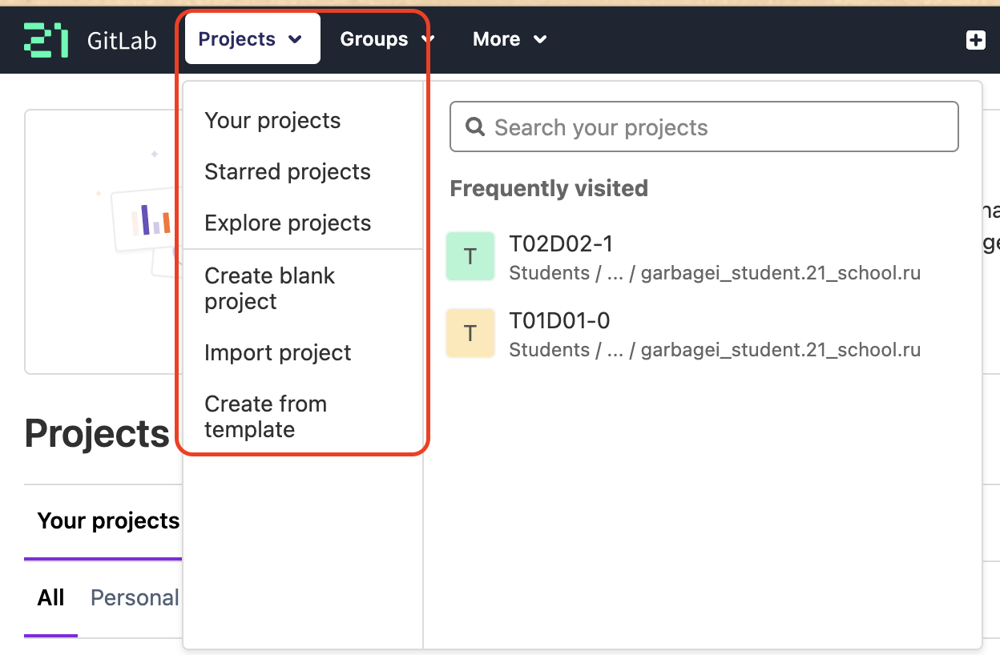
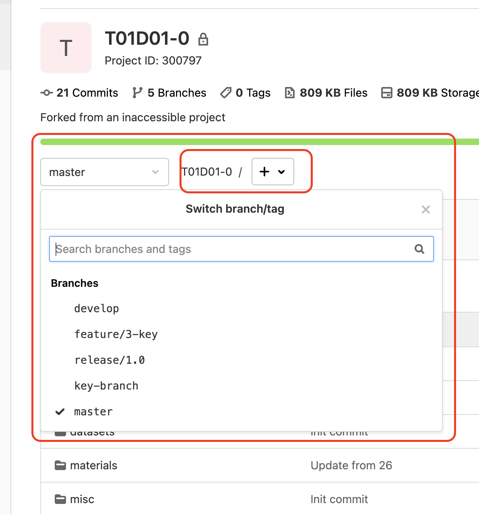
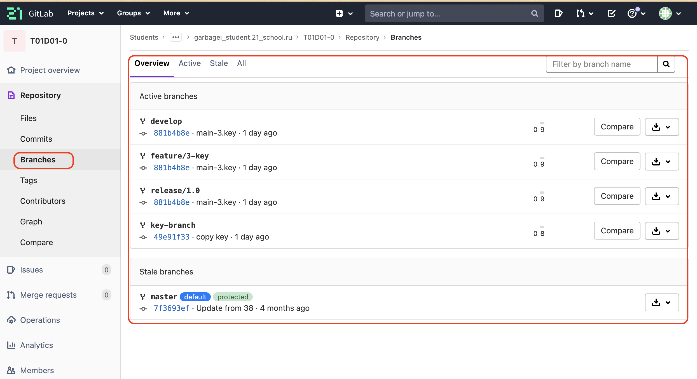
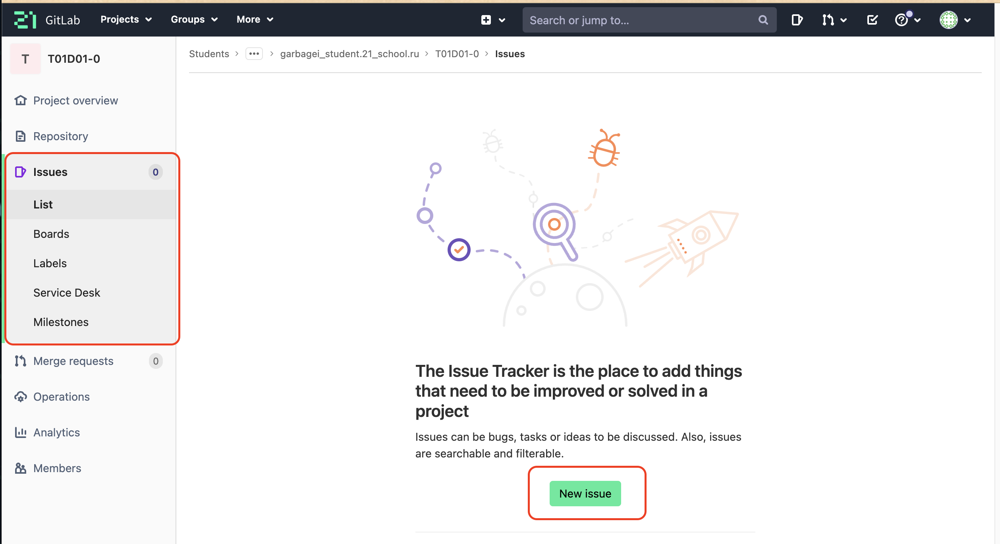
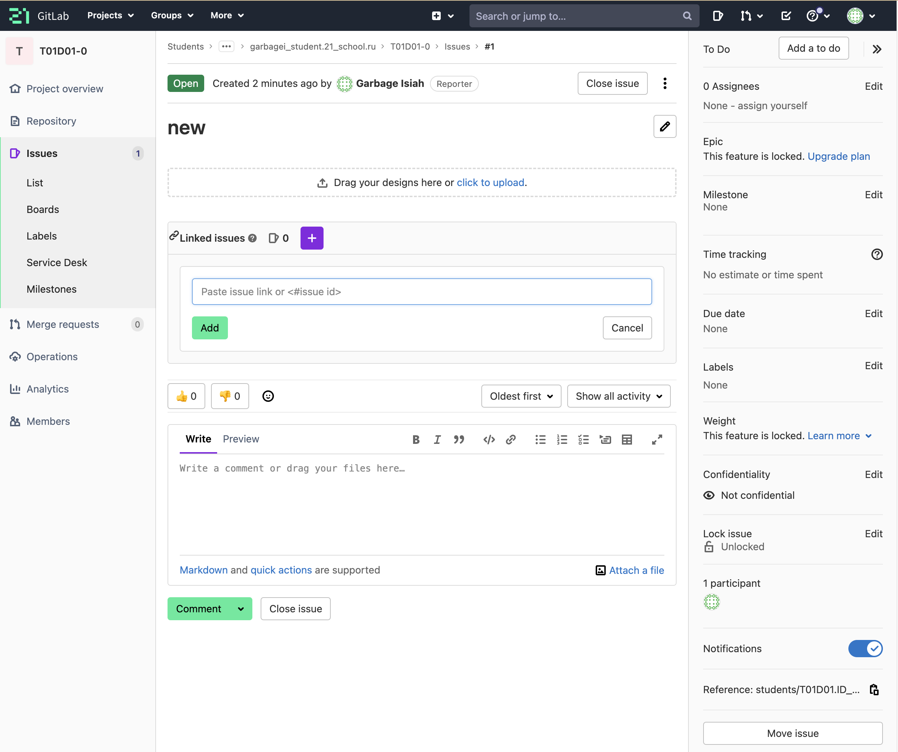
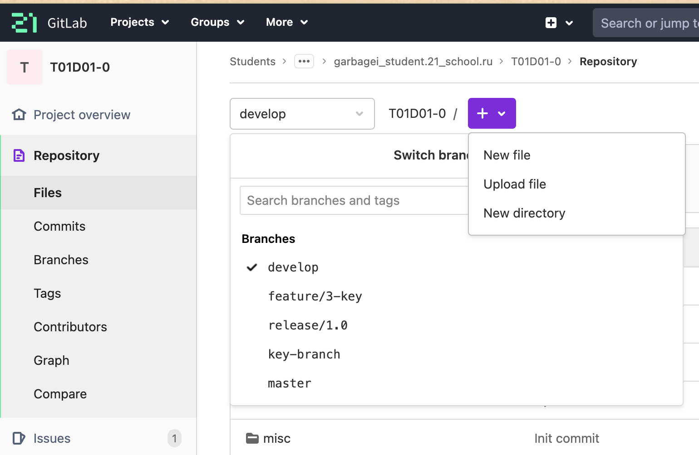
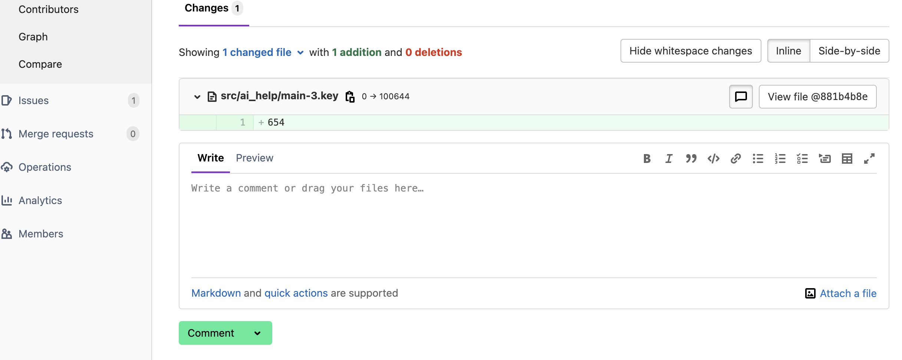

<a id='head'></a>
#Мануал о GitLab =)

___
__GitLab__ - это веб-платформа для управления репозиториями и разработки программного обеспечения с открытым исходным кодом. С помощью GitLab вы можете хранить свой код, управлять рабочими процессами, включая задачи, merge request'ы и code review, а также управлять правами доступа к вашему коду.

__GitLab__ предоставляет богатый набор функциональных возможностей, что делает его лучшим выбором для команд, работающих над проектами любого уровня сложности. В этом мануале мы рассмотрим основы работы с GitLab, начиная с создания личного репозитория и заканчивая работой с wiki проекта.

___

##Содержание
[1.Создание личного репозитория](#a)
[2.Создание веток develop и master](#b)
[3.Установка ветки develop по умолчанию](#c)
[4.Создание issue на создание текущего мануала](#d)
[5.Создание ветки по issue](#e)
[6.Создание merge request по ветке в develop](#f)
[7.Комментирование и принятие реквеста](#g)
[8.Формирование стабильной версии в master с простановкой тега](#s)
[9.Работа с wiki проекта](#ss)
___
##<a id="a"></a>1. Создание личного репозитория

Для начала необходимо зайти на страницу GitLab и авторизоваться. После этого необходимо нажать на кнопку "New project", чтобы создать новый проект.

Далее нужно указать название проекта, описание и выбрать тип проекта (публичный или приватный).

Далее нужно указать название проекта, описание и выбрать тип проекта (публичный или приватный).

___
##<a id="b"></a>2. Создание веток develop и master
После создания репозитория необходимо создать две ветки: develop и master. Для этого нужно перейти на страницу проекта, нажать на кнопку "Branches" и ввести название новой ветки.

Также можно создать ветки через командную строку, используя следующие команды:

```
$ git checkout -b develop
$ git checkout -b master
```

___
##<a id="c"></a>3. Установка ветки develop по умолчанию
Чтобы установить ветку develop по умолчанию, нужно перейти на страницу проекта, нажать на кнопку "Repository" и выбрать вкладку "Branches". Здесь нужно выбрать ветку develop в качестве ветки по умолчанию.

___
##<a id="d"></a>4. Создание issue на создание текущего мануала
Для создания нового issue нужно перейти на страницу проекта и нажать на кнопку "Issues". Затем нужно нажать на кнопку "New issue" и указать название задачи, описание и назначить ответственного за ее выполнение.

___
##<a id="e"></a>5. Создание ветки по issue
После создания issue необходимо создать новую ветку для работы над задачей. Для этого нужно перейти на страницу issue и нажать на ссылку "Create branch".

Здесь нужно указать название новой ветки и выбрать базовую ветку (например, develop).


___
##<a id="f"></a>6. Создание merge request по ветке в develop
После завершения работы над задачей необходимо создать merge request, чтобы объединить изменения в ветке develop. Для этого нужно перейти на страницу ветки с завершенной работой и нажать кнопку "New merge request".

Здесь нужно выбрать ветку с выполненной задачей в качестве "Source branch" и ветку develop в качестве "Target branch". Затем нужно указать описание изменений и нажать кнопку "Submit merge request".

___
##<a id="g"></a>7. Комментирование и принятие реквеста

После создания merge request можно комментировать изменения и обсуждать дальнейшие шаги. Если все изменения соответствуют требованиям, то можно принять merge request.

___
##<a id="s"></a>8. Формирование стабильной версии в master с простановкой тега

После того, как все изменения были приняты и объединены в ветке develop, нужно формировать стабильную версию проекта в ветке master и проставить тег. Для этого нужно перейти на страницу ветки master и нажать на кнопку "Create a new tag".
___
##<a id="ss"></a>9. Работа с wiki проекта


GitLab также позволяет создавать вики страницы для проектов. Для создания новой страницы нужно перейти на страницу проекта, нажать на кнопку "Wiki" и выбрать "Create new page".

Здесь нужно указать название страницы и начать редактирование содержимого.

___
##Заключение

GitLab является универсальной системой управления версиями, которая позволяет эффективно работать над проектами. В этом мануале мы рассмотрели основные шаги по использованию GitLab для создания репозитория, работы с ветками, создания issue и merge request, формирования стабильной версии и работы с вики. Надеемся, что этот мануал поможет вам успешно использовать GitLab в ваших проектах.

#Всем удачи на  _И_ нТеНсИв _Е_ =)


##[ВВЕРХ](#head)

